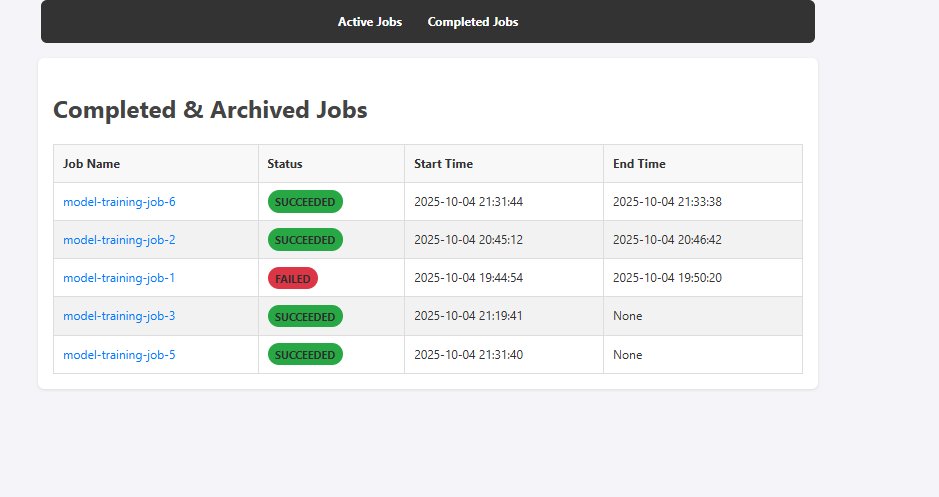

# Ray Jobs Watch

A simple and effective web UI for monitoring the status and logs of your [Ray Jobs](https://docs.ray.io/en/latest/ray-core/jobs/index.html) on a Kubernetes cluster.


## 🚀 The Problem

Tracking the lifecycle and logs of Ray Jobs submitted to a Kubernetes cluster can be challenging. The default way to get logs is through the submission client, but if the client disconnects or you want a centralized place to view all job statuses, you need a dedicated tool. `ray-jobs-watch` provides a lightweight, read-only interface to solve exactly this problem.

## ✨ Features

* **Job Dashboard:** View all running, succeeded, failed, and stopped jobs in a single, clean interface.
* **Real-time Log Streaming:** Click on any running job to view its logs live as they are generated.
* **Historical Log Access:** Easily access and review the full logs of completed jobs.
* **Lightweight:** A minimal Python backend and a simple frontend mean low resource consumption.
* **Easy Deployment:** Deploy to any Kubernetes cluster in minutes with the included Helm chart.

## ✅ Prerequisites

Before you begin, ensure you have the following:

* A running Kubernetes cluster (v1.21+).
* [Helm v3+](https://helm.sh/docs/intro/install/) installed.
* A running Ray Cluster within your Kubernetes environment.
* Your `kubectl` context configured to point to your cluster.

## 📦 Installation with Helm

This is the recommended method for installing `ray-jobs-watch` on Kubernetes.

### 1. Add Helm Repository

First, add the Helm repository that contains the `ray-jobs-watch` chart.

```sh
# Replace <repo-url> with the URL of your Helm repository (e.g., from GitHub Pages)
helm repo add ray-jobs-watch <repo-url>
helm repo update
```
*(If you haven't set up a Helm repository yet, users can install directly from the Git repo as shown in the next section).*

### 2. Install Directly from Git (Alternative)

If you don't have a packaged chart repository, you can install directly from your Git repository:

```sh
# Clone the repository
git clone [https://github.com/YOUR_USERNAME/ray-jobs-watch.git](https://github.com/YOUR_USERNAME/ray-jobs-watch.git)
cd ray-jobs-watch

# Install the chart from the local path
helm install ray-watch ./charts/ray-jobs-watch \
  --namespace default \
  --set ray.address="http://<ray-head-service-name>.<namespace>.svc.cluster.local:8265"
```

### 3. Configuration

The most critical configuration is setting the address of your Ray head service. The watcher needs this to communicate with the Ray Cluster's API.

You can install the chart with a custom value for the Ray address like this:

```sh
# Example: If your Ray head service is named 'ray-head-svc' in the 'ray-cluster' namespace
helm install ray-watch ray-jobs-watch/ray-jobs-watch \
  --namespace default \
  --set ray.address="[http://ray-head-svc.ray-cluster.svc.cluster.local:8265](http://ray-head-svc.ray-cluster.svc.cluster.local:8265)"
```

### Chart Values

The following table lists the configurable parameters of the `ray-jobs-watch` chart and their default values.

| Parameter              | Description                                        | Default                                 |
| ---------------------- | -------------------------------------------------- | --------------------------------------- |
| `replicaCount`         | Number of deployment replicas.                     | `1`                                     |
| `image.repository`     | Image repository.                                  | `your-docker-repo/ray-jobs-watch`       |
| `image.pullPolicy`     | Image pull policy.                                 | `IfNotPresent`                          |
| `image.tag`            | Image tag (app version).                           | `""`                                    |
| `ray.address`          | **Required:** The address of the Ray head service. | `""`                                    |
| `service.type`         | Kubernetes service type.                           | `ClusterIP`                             |
| `service.port`         | Service port.                                      | `80`                                    |
| `ingress.enabled`      | Enable Ingress.                                    | `false`                                 |
| `ingress.hosts`        | Ingress hostnames.                                 | `[]`                                    |
| `resources`            | Pod resource limits and requests.                  | `{}`                                    |


## 💻 Usage

By default, the service is only exposed within the cluster. To access the UI, you can use `kubectl port-forward`:

```sh
# Replace 'ray-watch' with your Helm release name if you used a different one
kubectl port-forward svc/ray-watch-ray-jobs-watch 8080:80
```

Now, open your web browser and navigate to: **http://localhost:8080**

You should see the Ray Jobs Watch dashboard.

